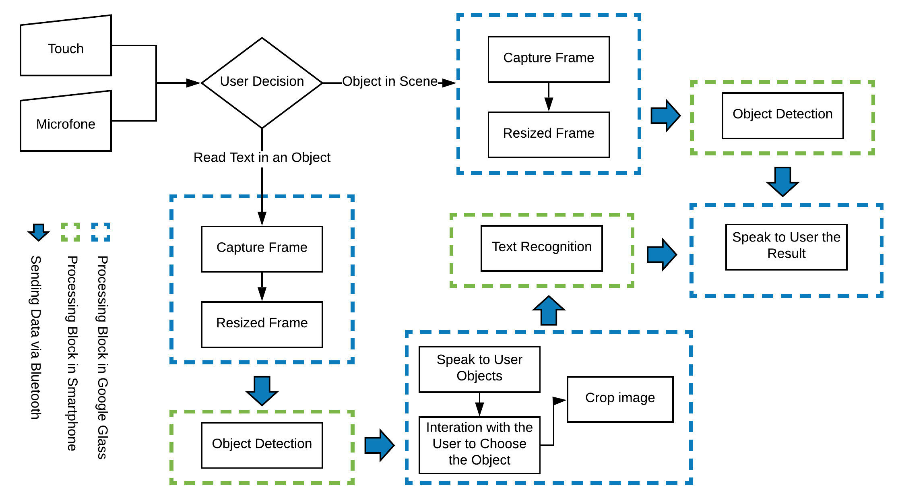

# BlindAssistant

## General Description

  The proposed system is based on interaction between Google Glass and Smarthphone which is able to detect and recognize the scene text information and convert the text into speech and then the text information will be transfer to visually impaired people by speech.
The Google Glass will be a user interface and the smarthphone will process the data obtained.

### Project Architecture

## Devices

**Smarthphone-side**:
[README](BlindAssistant-Smarthphone-side/README.md)

**GoogleGlass-side**:
[README](BlindAssistant-GoogleGlass-side/README.md)

## Dependencies

* Java with version >= Java 1.8.\*
* AndroidStudio 

##
