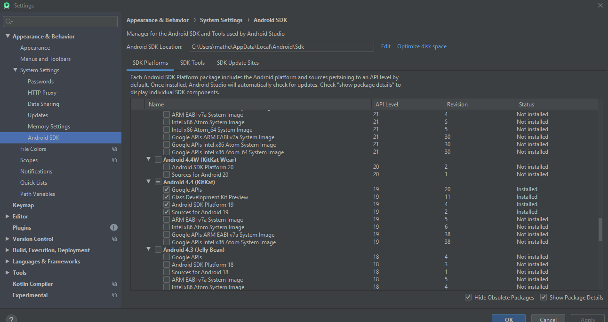
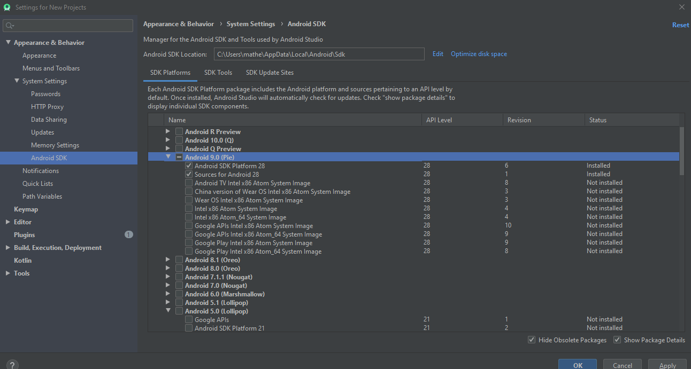
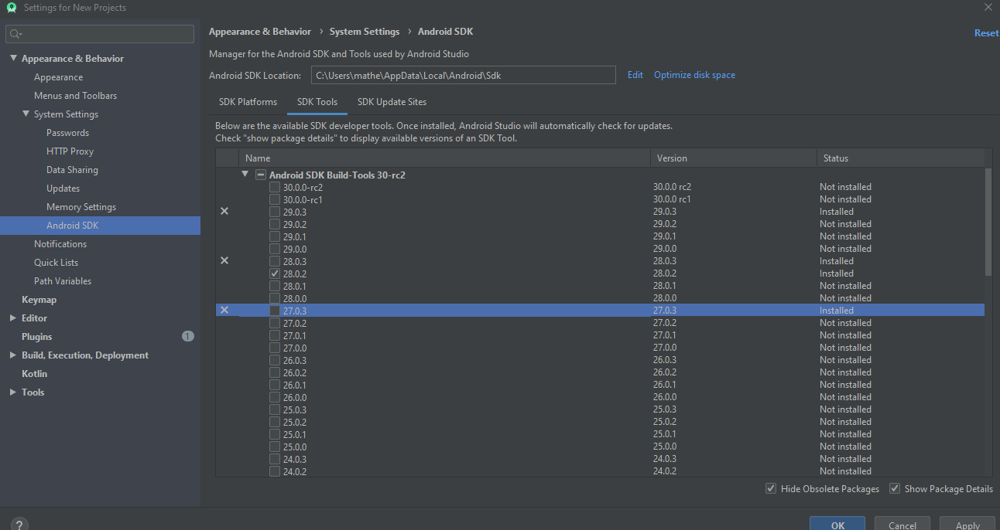

# BlindAssistant

## General Description

  The proposed system is based on interaction between Google Glass and Smarthphone which is able to detect and recognize the scene text information and convert the text into speech and then the text information will be transfer to visually impaired people by speech.
The Google Glass will be a user interface and the smarthphone will process the data obtained.

### Project Architecture

## Google Glass Side

This device is responsible for the user interface. The user will be able to send a command by voice or by tapping its sensor to have the system perform one of the two operations described in the project architecture sketch just above. 

It also has the purpose of capturing images that are being observed by the user and sent to Google Glass when a command is triggered.

## Smartphone Side
The Smartphone is responsible for the processing of images by Google Glass that are sent via Bluetooth. It will process the images both by OCR and by the object detector.

Through it the user can select Google Glass to perform the pairing.

## Dependencies

* Java with version >= Java 1.8.\*
* AndroidStudio 

## AndroidStudio Configuration

* Open AndroidStudio and import the project.
* Configure the sdk through the SDK manager. Click in File> Settings> System Settings> Android SDK and in the SDK Platform and SDK Tools tabs perform the following configuration:

* Click in Apply, download and install the packages, and click in Ok.

## Install Projects in Devices

* Click in Run> run'app' and select device or build project and install the apk files in devices.

